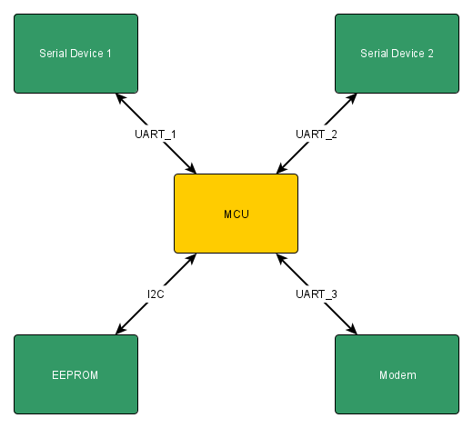

# AdhereTech Exercise

## Overview

The goal of this exercise is to produce a codebase that mimics a device that contains a modem, in which it is connected by some interface and able to Tx/Rx `AT` commands. Additionally there are two serial interfaces, in which data can be received to be sent on to the modem. Additionally there is an EEPROM that can be written to, via SPI.

This repo contains pseudo-code, leveraging FreeRTOS calls to represent a framework of this theoretical device.

### System Architecture

The system architecture is as shown below.

### Software Architecture

Below is a depiction of the software architecture and the hardware that each module interacts with.

