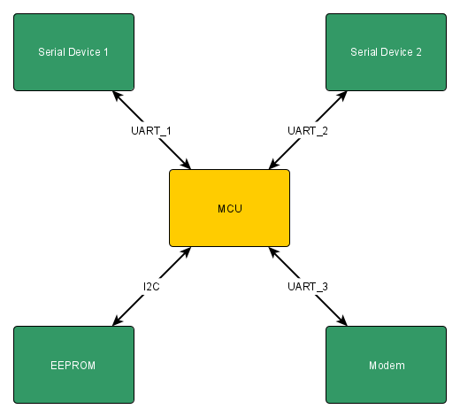
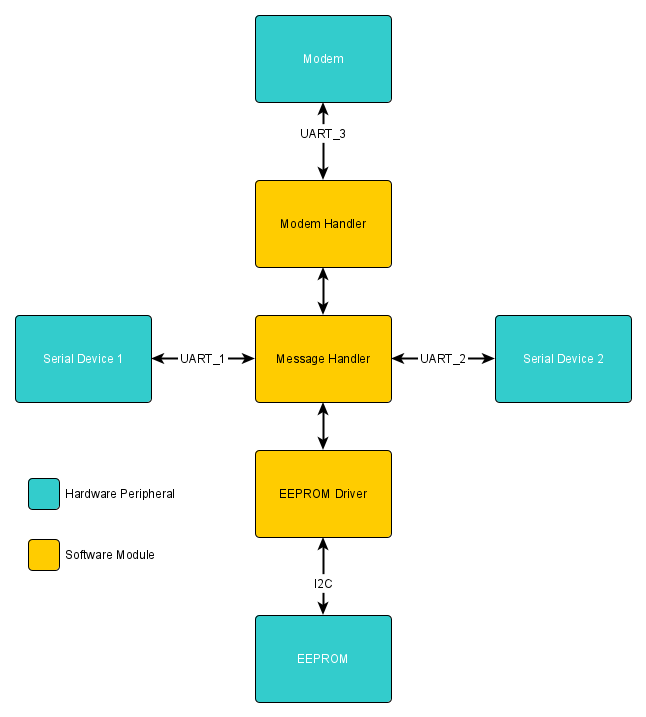

# AdhereTech Exercise

## Overview

This repo contains pseudo-code, leveraging FreeRTOS calls to represent a framework of a theoretical device.

### System Architecture

The system architecture is as shown below.

### Software Architecture

